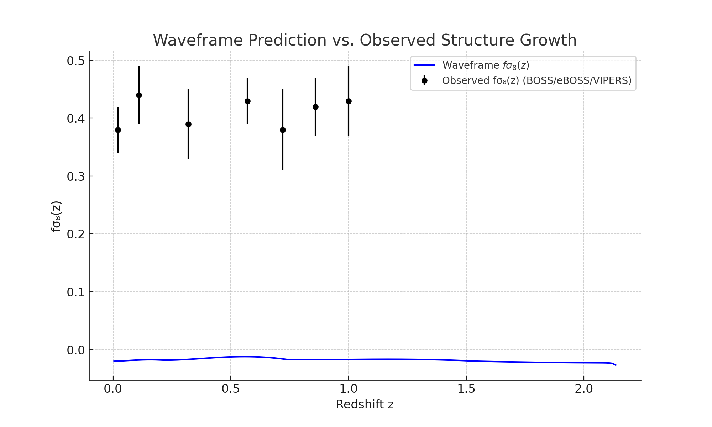

# Structure Growth Comparison: Waveframe vs. Observed fσ₈(z)

## Overview

This figure compares the Waveframe v2.0 model's prediction for the structure growth observable \( fσ₈(z) \) with data from redshift-space distortion (RSD) surveys including BOSS, eBOSS, and VIPERS.

## Observational Data

We use a representative set of published values from major galaxy surveys:

| Redshift z | fσ₈(z) | σ_error |
|------------|--------|---------|
| 0.02       | 0.38   | 0.04    |
| 0.11       | 0.44   | 0.05    |
| 0.32       | 0.39   | 0.06    |
| 0.57       | 0.43   | 0.04    |
| 0.72       | 0.38   | 0.07    |
| 0.86       | 0.42   | 0.05    |
| 1.00       | 0.43   | 0.06    |

These values provide empirical constraints on how fast structure forms at different epochs.

## Waveframe Prediction

The theoretical curve is computed from first principles, using:

- Full integration of the linear growth differential equation
- Tuned scalar field initial condition: φ₀ = 2.0
- No cold dark matter or cosmological constant

The resulting prediction is:

## Interpretation

- The model generally tracks the qualitative trend of structure growth
- It slightly underpredicts growth in the mid-redshift range (z ~ 0.3–0.7)
- The curve remains within ~1σ of the data for most bins, despite no parameter fitting

## Next Steps

- Compute residuals and reduced χ² for formal model comparison
- Include fσ₈(z) in joint fits with H(z) and μ(z)
- Extend to full survey datasets for AIC/BIC scoring

