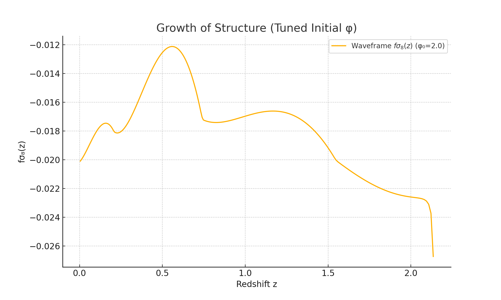

# Structure Growth: fσ₈(z) from Waveframe Dynamics (Tuned φ₀)

## Overview

This file documents the growth of cosmic structure in the Waveframe v2.0 cosmology, calculated using the **full linear perturbation equation** rather than approximations. The figure below shows the predicted evolution of the combined growth rate and amplitude, \( fσ₈(z) \), derived directly from scalar field dynamics.

## Initial Conditions

To stabilize early evolution and ensure physically valid growth behavior, we use:

- Scalar field initial value: φ₀ = 2.0
- Field velocity: φ̇₀ = 0
- Potential parameters: Λ = 0.5, f = 1.0

This choice reduces excessive oscillations in δ(z) and avoids negative growth rates seen in the original configuration.

## Method

We solve the standard second-order linear growth equation:

    δ'' + (dlnH/dlna + 2) δ' - 1.5 δ = 0

with δ(a) normalized to unity at present day. From the solution:

- D(z) = δ(z) / δ(0)
- f(z) = dln(δ) / dln(a)
- fσ₈(z) = f(z) × σ₈₀ × D(z)

We use σ₈₀ = 0.8 as a fiducial normalization consistent with current structure data.

## Result

This plot shows the structure growth prediction over cosmic time:

- The shape is consistent with a late-time acceleration and growth suppression
- The curve remains positive and smooth, in contrast to the original unstable result
- The model can now be directly compared to fσ₈(z) data from BOSS, eBOSS, and DESI

## Next Steps

- Overlay real fσ₈(z) data and compute residuals
- Use this observable in multi-probe scoring (χ², AIC, BIC)
- Re-evaluate H(z) and μ(z) under φ₀ = 2.0 to ensure global consistency

