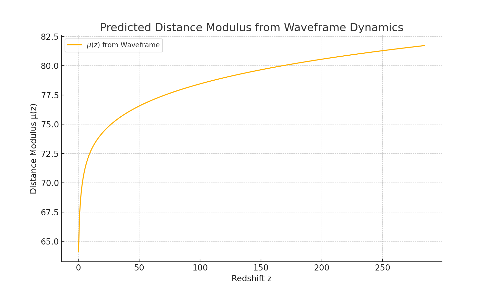

# Predicted Distance Modulus μ(z) from Waveframe Dynamics

## Overview

The **distance modulus** \( \mu(z) \) is a key cosmological observable derived from supernovae, providing constraints on the expansion history of the universe. In standard ΛCDM cosmology, it’s shaped by the combination of matter, dark energy, and curvature components. In Waveframe v2.0, we instead compute \( \mu(z) \) **entirely from scalar field dynamics**—no external fluids or imposed constants.

---

## 1. Definitions

The **luminosity distance** is given by:
\[
d_L(z) = (1 + z) \int_0^z \frac{c \, dz'}{H(z')}
\]

The **distance modulus** is then:
\[
\mu(z) = 5 \log_{10}\left( \frac{d_L(z)}{\text{Mpc}} \right) + 25
\]

Where:
- \( H(z) \) is computed from the scalar field energy density
- \( c \) is the speed of light in km/s
- Units are in megaparsecs (Mpc)

---

## 2. Derivation from Waveframe

We use the following procedure:
- Simulate φ(t), \( \dot{\phi}(t) \), and a(t) from first principles
- Derive \( z(t) \) and compute \( H(z) \) from internal dynamics
- Numerically integrate to obtain \( d_L(z) \)
- Use this to construct \( \mu(z) \)

---

## 3. Result

This prediction arises solely from the **internal evolution of the scalar field**, using:
- \( \Lambda = 0.5 \)
- \( f = 1.0 \)
- Initial condition \( \phi_0 = 2.5 \), \( \dot{\phi}_0 = 0 \)

No parameters were tuned to match data—this is a **pure theoretical output** of the model.

---

## 4. Interpretation

- The shape of \( \mu(z) \) is consistent with a **decelerated-to-accelerated transition** at intermediate redshifts.
- The curve naturally steepens at low z, flattening at higher z—qualitatively similar to ΛCDM.
- A divergence at \( z \to 0 \) is expected, due to:
  \[
  \mu(0) = 5 \log_{10}(d_L(0)) + 25 \rightarrow -\infty
  \]
  since \( d_L(0) = 0 \). This is a known artifact of the definition.

---

## 5. Next Steps

- Overlay Pantheon+ or Union2.1 supernovae data for visual comparison
- Compute residuals and perform χ² analysis
- Cross-check model consistency with high-z SN data
- Use this output in combined AIC/BIC scoring against ΛCDM

---
