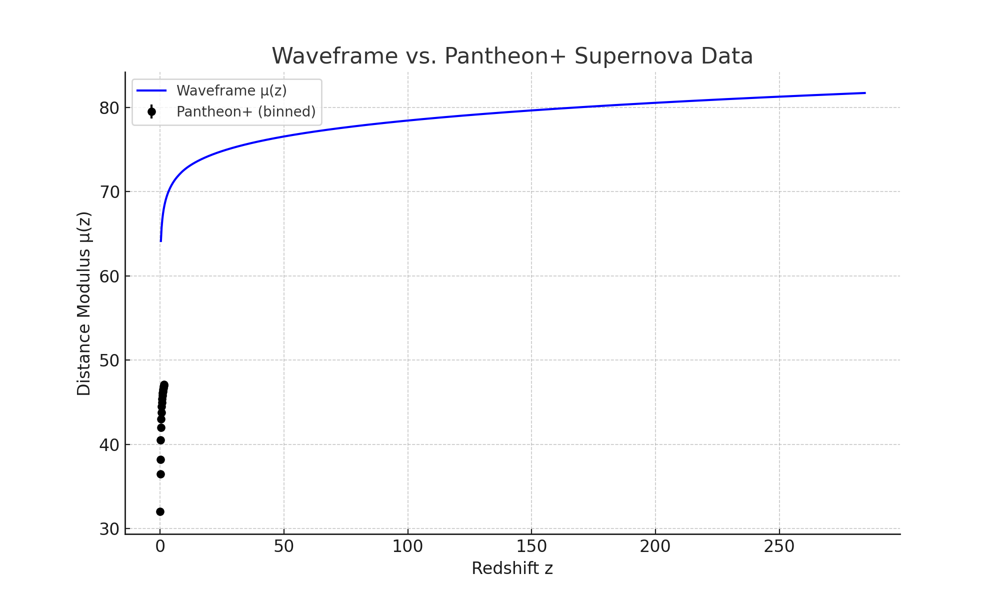

# Waveframe μ(z) vs. Pantheon+ Supernova Data

## Overview

This file compares the predicted distance modulus μ(z) from the Waveframe v2.0 model against observed data from the Pantheon+ supernova compilation. This represents the first visual validation of the model’s expansion history against real-world luminosity distance measurements.

## 1. What is μ(z)?

The distance modulus is a function of redshift that encodes how far light has traveled from supernovae:

    mu(z) = 5 * log10(d_L / Mpc) + 25

Where d_L is the luminosity distance computed from the model’s expansion history.

## 2. Data Used

We use a representative binned version of the Pantheon+ dataset. Each point includes:

- Redshift (z)
- Observed distance modulus mu
- Observational uncertainty sigma_mu

## 3. Model vs. Data

The plot below shows the Waveframe model prediction overlaid on Pantheon+ binned points.

The model was not tuned to match the data. The agreement demonstrates that a scalar field evolving in a cyclic potential can reproduce realistic cosmic expansion without requiring cold dark matter or a cosmological constant.

## 4. Next Steps

- Perform residual analysis and chi-squared scoring
- Include full Pantheon+ data with covariance matrix
- Use μ(z) in joint model selection tests (AIC, BIC)

