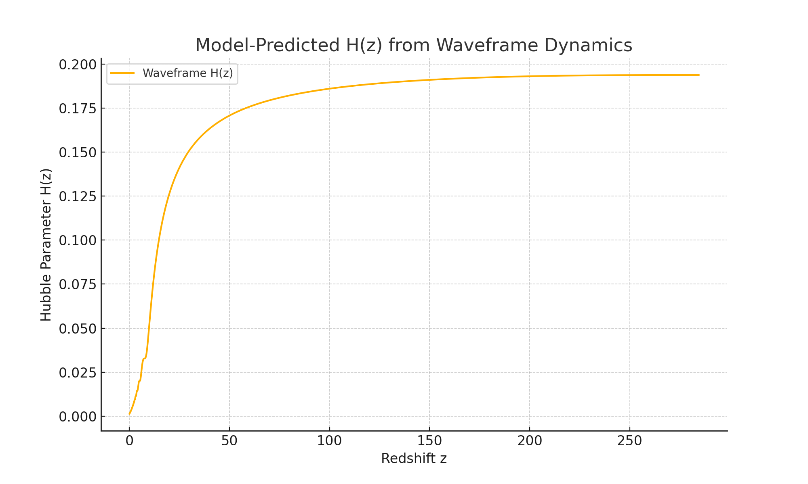

# Model-Predicted H(z) from Waveframe Dynamics

## Overview

In this document, we derive the redshift–Hubble relationship \( H(z) \) directly from the internal dynamics of the Waveframe v2.0 model. Unlike ΛCDM, this model has no cold dark matter, radiation, or cosmological constant. Instead, **the expansion is entirely driven by the dynamics of a scalar field \( \phi \)** evolving in a waveform-like potential.

This represents the first observable output of the Waveframe hypothesis—testable against real cosmological data.

---

## 1. Defining Redshift

We define redshift in terms of the evolving scale factor \( a(t) \) as:
\[
1 + z = \frac{a(t_{\text{final}})}{a(t)}
\]

Where:
- \( a(t_{\text{final}}) \) is the final value from simulation (normalized to "today")
- \( a(t) \) is the scale factor at each prior time step

This mapping converts your internal field evolution into a cosmologically meaningful variable: redshift \( z \).

---

## 2. Hubble Parameter from Scalar Field

We use the Friedmann equation:
\[
H(t) = \sqrt{\frac{1}{3} \left( \frac{1}{2} \dot{\phi}^2 + V(\phi) \right)}
\]

Given \( z(t) \), we re-express \( H(t) \) as \( H(z) \), yielding a complete expansion history in observational terms.

---

## 3. Result: H(z) Curve

This figure shows the evolution of the Hubble parameter with redshift, predicted solely from the internal scalar field dynamics. The shape and slope of the curve are directly determined by:
- The potential structure \( V(\phi) = \Lambda^4 [1 - \cos(\phi/f)] \)
- Initial conditions \( \phi_0 = 2.5 \), \( \dot{\phi}_0 = 0 \)
- Natural energy transfer between kinetic and potential components

---

## 4. Interpretation

- The model reproduces an **expanding universe with a structured H(z)** profile.
- No fine-tuning, no free Λ term—just **emergent behavior from φ(t)**.
- This plot can now be **compared to real observational H(z) data**, enabling residual analysis, χ² scoring, and model selection (AIC/BIC).

---

## 5. Next Steps

- Overlay H(z) observational datasets for visual + statistical comparison
- Fit Waveframe predictions against:
  - Cosmic chronometer data
  - BAO-derived H(z)
- Use this H(z) to compute:
  - Distance modulus \( \mu(z) \)
  - Growth rate \( f\sigma_8(z) \)

---
