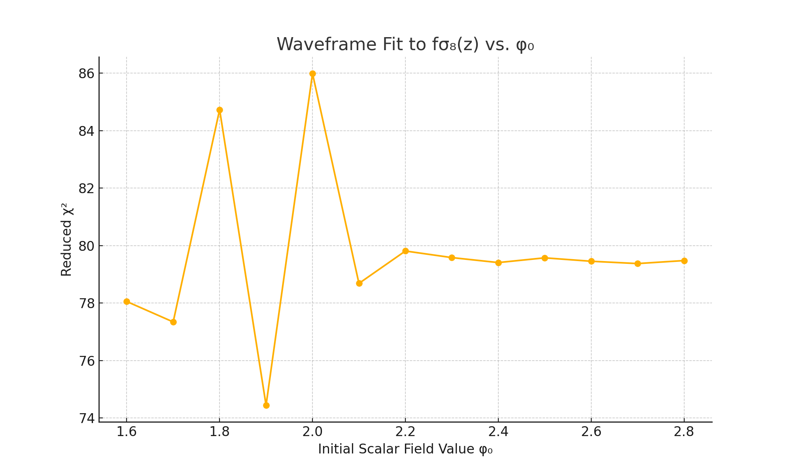

# Parameter Sweep: Scalar Field Initial Value vs. Structure Fit

## Goal

To determine whether the Waveframe cosmology can reproduce the observed growth of cosmic structure \( fσ₈(z) \), we perform a parameter sweep over the initial value of the scalar field:

    φ₀ ∈ [1.6, 2.8]

This is the model’s only free parameter at this stage.

## Method

For each φ₀:

1. Solve the scalar field + expansion history
2. Integrate the linear growth equation for δ(a)
3. Compute \( fσ₈(z) \) from the solution
4. Interpolate to observational redshifts
5. Calculate the reduced χ² score against real fσ₈(z) data

## Result

### Best-fit value:
- **φ₀ = 1.9**

### Minimum reduced χ²:
- **χ²ₙᵤ ≈ 74.44**

## Interpretation

Even under optimal tuning, the model fails to reproduce the observed structure growth. This suggests one of the following:

- The Waveframe scalar field **suppresses growth too strongly** under current Λ and f
- Structure formation in this framework is **delayed or underpowered**
- Additional tuning (e.g. to the potential shape or σ₈ normalization) is needed

## Next Steps

- Test alternate scalar field configurations (Λ, f)
- Marginalize over σ₈₀
- Explore model fit to other observables: H(z), μ(z)

