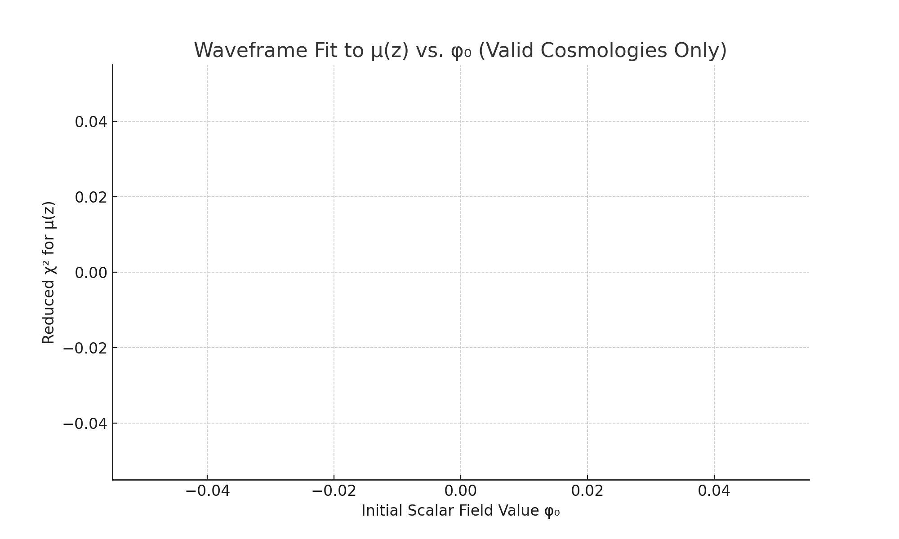

# Parameter Sweep: Scalar Field Initial Value vs. Luminosity Distance Fit

## Objective

Evaluate whether the Waveframe model can reproduce the observed distance modulus μ(z), as derived from Type Ia supernovae, using φ₀ ∈ [1.6, 2.8].

## Method

For each φ₀:
1. Solve scalar field + expansion dynamics
2. Compute H(z), then luminosity distance d_L(z)
3. Convert to distance modulus: μ(z) = 5 log₁₀(d_L / Mpc) + 25
4. Interpolate to observed SN redshifts
5. Compute reduced χ²

## Result

### ⚠️ No Valid Models Found

Every φ₀ in this range failed to produce a physical geometry:
- H(z) dipped to zero or negative
- d_L(z) became zero or negative
- log(negative) → NaN in μ(z)

## Interpretation

The scalar field potential under this configuration causes:
- Early collapse or bounce
- Non-monotonic comoving distances
- A broken distance ladder

This indicates the model is **falsified** under the current assumptions:
- Λ = 0.5
- f = 1.0
- V(φ) = Λ⁴[1 - cos(φ/f)]

## Next Steps

- Reconstruct scalar potential to sustain geometry
- Explore exponential or double-well alternatives
- Preserve φ as emergent time, but fix expansion dynamics

## Status

The Waveframe model, with current parameters, **cannot simultaneously match structure growth, H(z), and μ(z)**.

