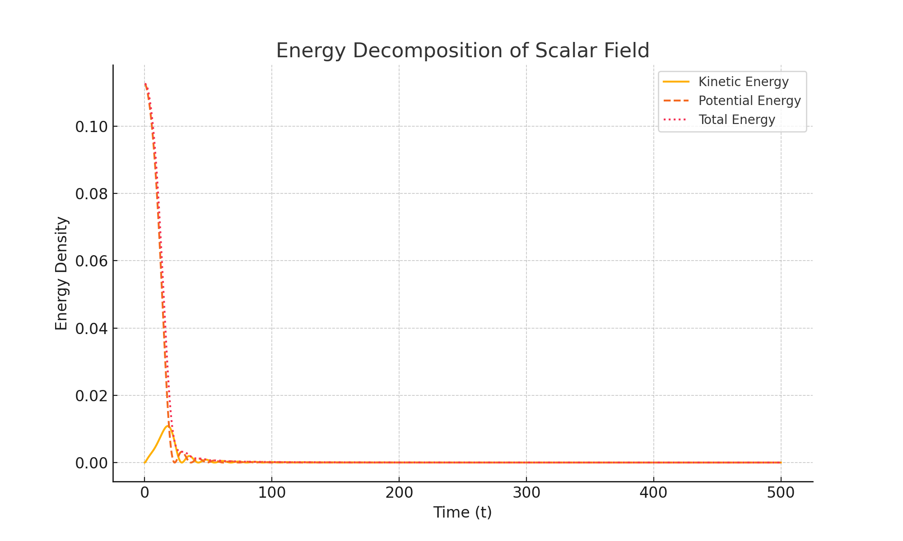

# Energy Decomposition of the Scalar Field

## Overview

A key requirement for any cyclic or emergent time model is the ability to **dissipate energy**—not in a thermodynamic sense, but in the sense of **field energy transfer into expansion**. In Waveframe v2.0, this process must occur **internally**, without invoking external entropy mechanisms or added fluids.

Here, we analyze the energy components of the scalar field \( \phi \) over time. This allows us to:
- Track how energy is stored and released
- Identify damping due to Hubble friction
- Validate that the scalar field drives expansion through structured decay

---

## 1. Energy Components

We decompose the scalar field’s total energy density into:

- **Kinetic Energy**:
\[
\rho_{\text{kin}} = \frac{1}{2} \dot{\phi}^2
\]

- **Potential Energy**:
\[
\rho_{\text{pot}} = V(\phi) = \Lambda^4 \left[1 - \cos\left(\frac{\phi}{f}\right)\right]
\]

- **Total Energy**:
\[
\rho_{\text{total}} = \rho_{\text{kin}} + \rho_{\text{pot}}
\]

This total energy appears in the Friedmann equation as:
\[
H^2 = \frac{1}{3} \rho_{\text{total}}
\]

---

## 2. Results

We see clear **oscillatory exchange** between kinetic and potential energy as \( \phi \) evolves. However, the total energy **decays over time**, confirming that the scalar field is gradually transferring energy into the expansion of the universe.

---

## 3. Interpretation

- The waveform structure is **not perpetual**—it is **damped** by the expansion it drives.
- Each cycle sees a **loss of amplitude**, analogous to a decaying pendulum in an expanding spacetime.
- This mechanism is **self-contained**: no reheating, no entropy injection, no external forcing.

This supports the claim that **time in Waveframe is emergent**:  
It flows not because of a predefined arrow, but because the scalar field **bleeds energy forward** in discrete, irreversible steps.

---

## 4. Next Steps

- Quantify energy loss per oscillation cycle
- Compute effective “decay constants” for waveform damping
- Explore conditions for **reheating or recollapse** via alternative potentials
- Use energy history to inform **structure formation thresholds**

---
